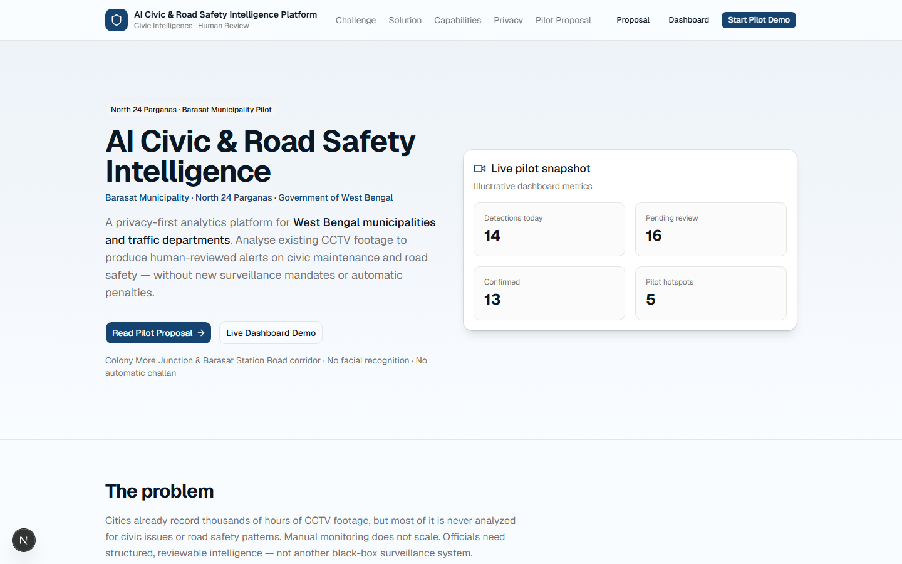
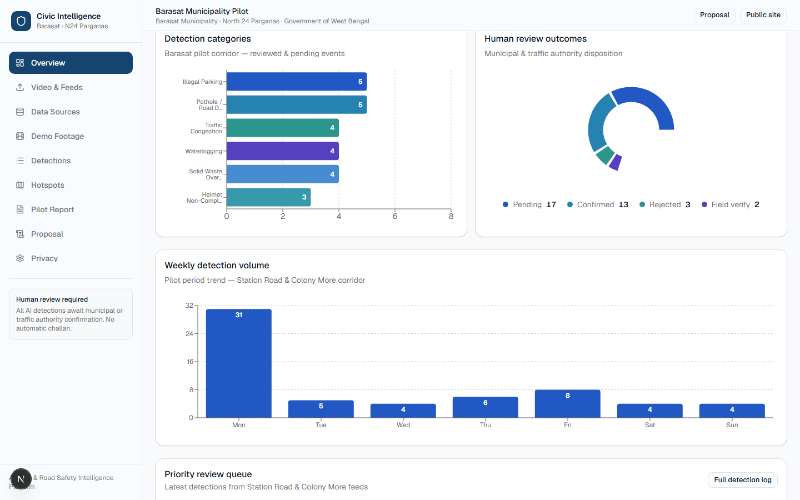
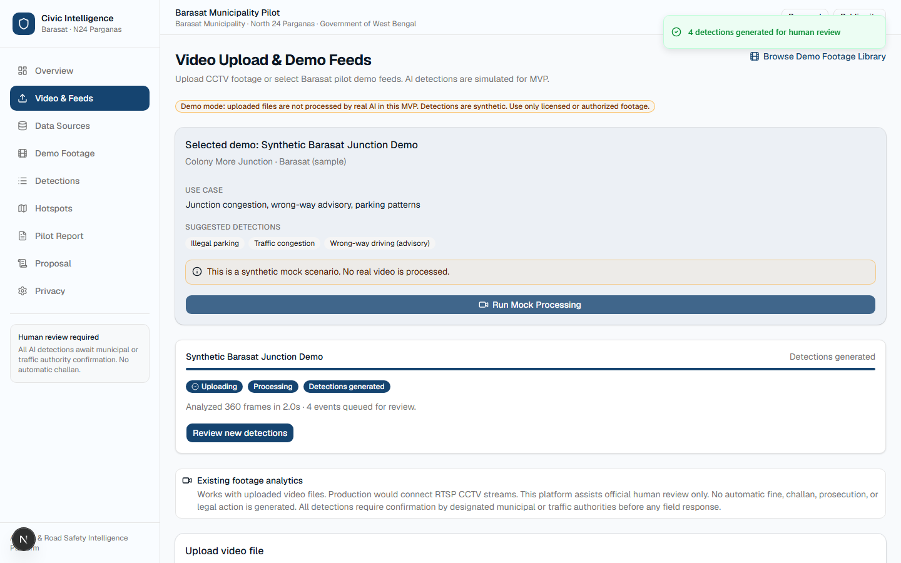
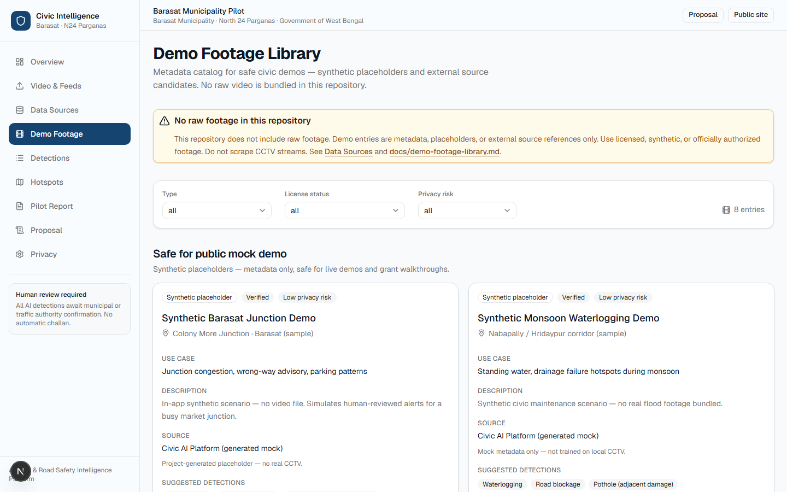
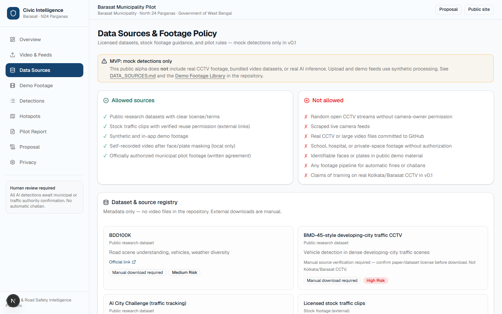
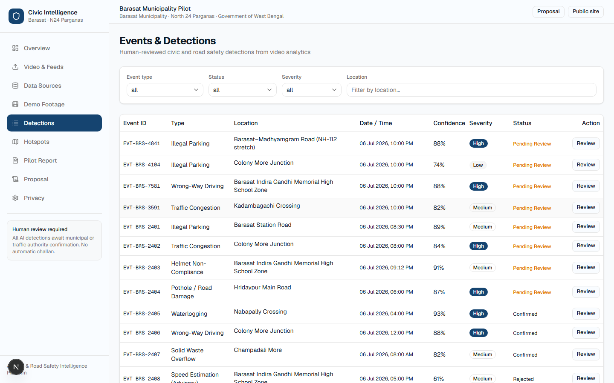
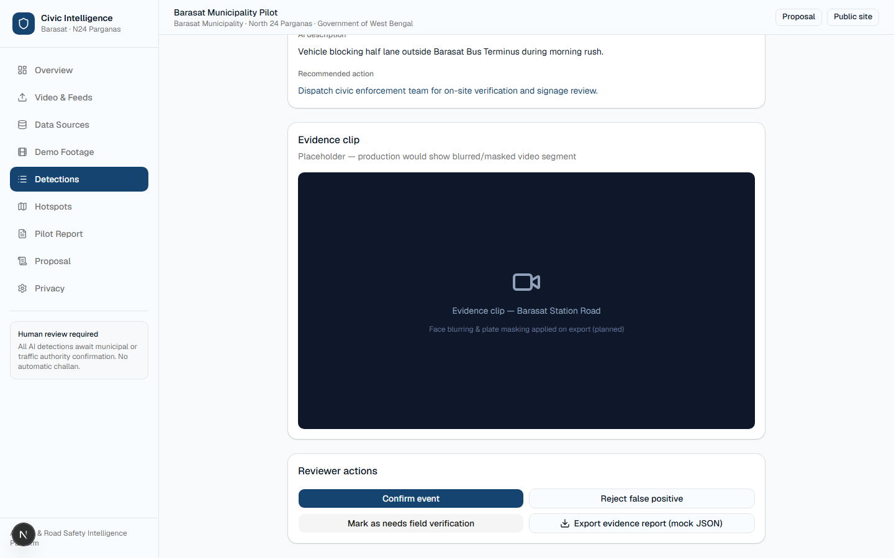
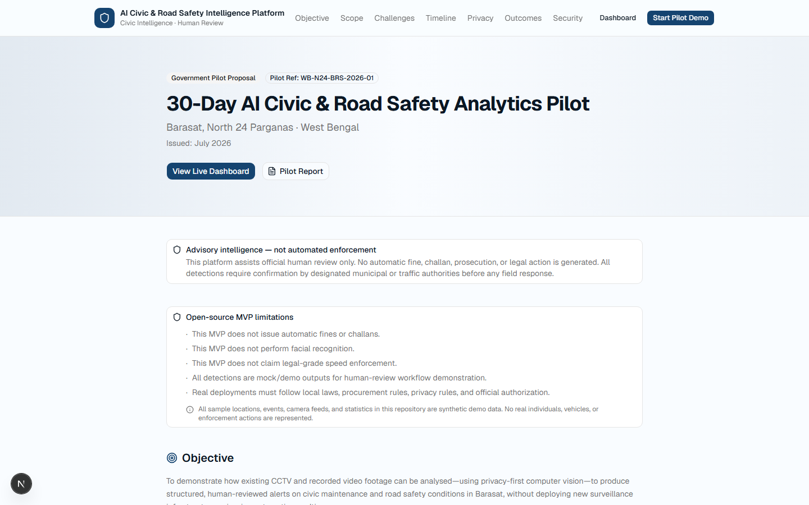
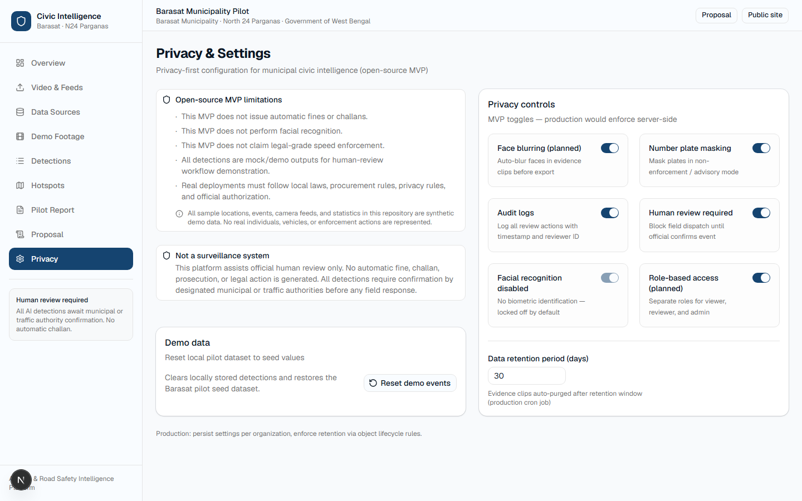

# AI Civic Operations & Road Safety Intelligence Platform

[](LICENSE)
[](https://nextjs.org/)
[](https://www.typescriptlang.org/)
[](package.json)
[](ROADMAP.md)
[](#privacy-first-design)
[](https://github.com/The-Human-Technologist/civic-ai-platform/actions/workflows/ci.yml)
[](https://civic-ai-platform-three.vercel.app)
[](https://github.com/The-Human-Technologist/civic-ai-platform)

**Maintained by [The Human Technologist](https://github.com/The-Human-Technologist)** · Open-source civic intelligence for municipalities, traffic departments, and civic authorities.

Turn **existing CCTV and uploaded video** into **human-reviewed** civic and road-safety insights — without building a surveillance system or automated enforcement stack.

| | |
|---|---|
| **Available in MVP** | Demo UI, mock detections, review workflow, reports, pilot proposal |
| **Planned** | Real CV models, RTSP ingest, tickets, production auth & audit |
| **Explicitly out of scope** | Auto fines/challans, facial recognition, legal-grade speed prosecution |

> **Honest scope:** This repository ships a **working demo dashboard** with **synthetic AI detections**. It is suitable for pilots, grants, and contributor onboarding — not for production deployment without completing [ROADMAP.md](ROADMAP.md) Phases 2–5 and local legal review. See [PRIVACY.md](PRIVACY.md) · [SECURITY.md](SECURITY.md).

## Public alpha status

| | |
|---|---|
| **What works today** | Full demo UI — landing, dashboard, human review, reports, pilot proposal |
| **AI inference** | **Mock only** (`processVideoMock`) — synthetic detections, not real computer vision |
| **CCTV / video** | Upload UX + demo feed cards — **no real CCTV or RTSP processing yet** |
| **Data** | Browser `localStorage` with 35 fake Barasat events — no production database |
| **Next milestone** | **Phase 2** — YOLO/OpenCV worker, PostgreSQL, real inference API |
| **Contributors wanted** | CV engineers, civic-tech devs, i18n, accessibility — see [good first issues](docs/good-first-issues.md) |
| **Footage policy** | [DATA_SOURCES.md](DATA_SOURCES.md) — no real CCTV in repo; mock only by default |

**Quick start:** `npm install && npm run dev` → [http://localhost:3000](http://localhost:3000)

---

## Table of contents

- [Public alpha status](#public-alpha-status)
- [Project mission](#project-mission)
- [Why this matters](#why-this-matters)
- [Who can use it](#who-can-use-it)
- [Core workflow](#core-workflow)
- [MVP feature list](#mvp-feature-list)
- [Future AI integrations](#future-ai-integrations-planned)
- [Privacy-first design](#privacy-first-design)
- [Government demo positioning](#government-demo-positioning)
- [Screenshots](#screenshots)
- [Open-source roadmap](#open-source-roadmap)
- [Tech stack](#tech-stack)
- [Quick start (local)](#quick-start-local)
- [GitHub Codespaces](#github-codespaces-zero-install)
- [Architecture](#architecture)
- [Project structure](#project-structure)
- [Installation](#installation)
- [Deploy on Vercel](#deploy-on-vercel)
- [Mock AI processing](#how-mock-ai-processing-works-mvp)
- [Footage and datasets](#footage-and-datasets)
- [Contributing](#contributing)
- [Student contributors](#student-contributors-github-education)
- [License](#license)

---

## Project mission

**Help municipalities and traffic departments turn existing CCTV and video footage into human-reviewed civic and road-safety insights.**

Most cities already record video — at junctions, markets, schools, hospitals, and municipal assets — but rarely analyse it systematically for **civic maintenance** (potholes, drainage, waste) or **advisory road safety** (congestion, parking, near-miss patterns).

This project provides an open, auditable software foundation that:

1. Accepts **footage you already have** (upload today; RTSP in a later phase)
2. Produces **structured detection events** with confidence scores and evidence placeholders
3. Requires **official human review** before any ticket, report, or field action
4. Surfaces **analytics** for departments — not automatic penalties

We call this **civic intelligence** and **municipal operations analytics**, not surveillance.

---

## Why this matters

Urban agencies face predictable, recurring problems that video could help surface earlier — if workflows respect privacy and human oversight.

| Problem | Why it hurts | How this project helps (when fully deployed) |
|---------|--------------|---------------------------------------------|
| **Potholes & road damage** | Accidents, vehicle damage, citizen complaints | Flag surface defects for PWD / municipality repair queues |
| **Waterlogging** | Monsoon disruption, health risk, traffic chaos | Map drainage failure hotspots from standing-water detections |
| **Garbage overflow** | Sanitation backlog, blocked drains | Alert solid-waste teams with geo-tagged evidence |
| **Illegal parking** | Blocked fire lanes, bus stops, footpaths | Highlight recurring zones for **manual** enforcement planning |
| **Wrong-way driving** | Junction risk, especially near markets & schools | Advisory flags for signage / traffic engineering review |
| **Road blockage** | Fallen debris, construction dumps | Faster clearance coordination |
| **Congestion** | Lost time, emissions, emergency delays | Congestion index for signal timing & corridor studies |
| **Delayed civic response** | Issues worsen before tickets exist | Earlier structured alerts → review → department routing |
| **Manual monitoring overload** | Control rooms cannot watch every feed | AI pre-filter → humans decide what matters |

**Today (MVP):** the dashboard **demonstrates** this workflow with **fake detections** and sample Barasat geography so stakeholders can evaluate UX, governance, and privacy posture before investing in real models.

---

## Who can use it

| Audience | Typical use |
|----------|-------------|
| **Municipalities** | Civic issue triage, ward-level hotspot reports, pilot proposals |
| **Traffic police** | Advisory road-safety analytics (not auto-challan) |
| **Transport departments** | Corridor studies, school-zone safety reviews |
| **Smart city teams** | Integration planning with existing CCTV inventory |
| **Gated communities** | Internal maintenance & parking pattern review |
| **Schools & hospitals** | Zone safety advisory around entrances (with authorization) |
| **Market associations** | Waste & congestion coordination with local bodies |
| **Civic-tech researchers** | Open codebase for privacy-preserving video analytics study |

**Deployers** must obtain legal authorization to process video in their jurisdiction. This software does not grant that permission.

---

## Core workflow

End-state design (full platform). **Bold** = available in MVP.


| Step | MVP status | Description |
|------|------------|-------------|
| **Video / CCTV footage** | **Partial** | File upload + 3 demo feed cards. No live RTSP yet. |
| **AI detection** | **Mock only** | `processVideoMock()` — synthetic events, not real CV. |
| **Human review** | **Yes** | Confirm · Reject · Field verification · evidence JSON export. |
| **Ticket / report** | **Partial** | Printable pilot report + JSON export. No external ticketing API. |
| **Department action** | Planned | Phase 4 work-order routing. |
| **Resolution tracking** | Planned | Ticket status sync & SLA dashboards. |
| **Analytics dashboard** | **Yes** | KPIs, charts, hotspot map (stylized), detection log. |

---

## MVP feature list

### Available in MVP

- [x] **Landing page** — mission, capabilities, privacy positioning
- [x] **Operations dashboard** — KPIs, charts, review queue
- [x] **Mock video processing** — upload UX + simulated pipeline progress
- [x] **Detection event table** — filter by type, status, severity, location
- [x] **Event review page** — human disposition + evidence placeholder
- [x] **Hotspot map** — stylized Barasat map (not GIS/Mapbox yet)
- [x] **Reports page** — 30-day pilot report, print / save as PDF
- [x] **Pilot proposal page** — government-ready 30-day pilot document
- [x] **Privacy settings page** — retention & masking toggles (UI only)
- [x] **Mock AI detection service** — isolated in `src/lib/mock-ai/processor.ts`

### Planned (not in this release)

- [ ] Real YOLO / OpenCV inference pipeline
- [ ] RTSP / live CCTV ingest
- [ ] PostgreSQL + REST API
- [ ] Authentication & role-based access
- [ ] Work-order / ticket integrations
- [ ] Face blur & plate mask on ingest
- [ ] Immutable audit logs (server-side)
- [ ] Production GIS map layer

---

## Future AI integrations (planned)

The mock module is intentionally swappable. Production integration targets:

| Capability | Purpose | Status |
|------------|---------|--------|
| **YOLO** | Vehicle, person-shape, helmet, waste, pothole class detection | Planned Phase 2 |
| **OpenCV** | Pre/post-processing, motion, lane proxies, frame sampling | Planned Phase 2 |
| **RTSP CCTV stream** | Sample existing authorised camera feeds | Planned Phase 3 |
| **ANPR OCR** | Plate read for **masked advisory** use only — not auto prosecution | Planned, optional |
| **Face blurring** | Privacy on evidence clips before storage | Planned Phase 5 |
| **Number plate masking** | Default in non-enforcement mode | Planned Phase 5 |
| **Object tracking** | Consistent IDs across frames for congestion & near-miss context | Planned Phase 2 |
| **Speed estimation** | Advisory school-zone estimates — **not** legal enforcement | Planned Phase 2 |
| **Accident / near-miss detection** | Sudden braking, trajectory conflict heuristics | Planned Phase 2 |
| **Pothole / waterlogging detection** | Surface & standing-water segmentation | Planned Phase 2 |

Search the codebase for **`REAL AI INTEGRATION`** for hook points.

---

## Privacy-first design

Privacy is a **product requirement**, not a marketing footnote.

| Principle | MVP | Planned |
|-----------|-----|---------|
| **No facial recognition by default** | Enforced — feature absent; UI locked off | Remains off unless separate legal RFC |
| **No automatic fines or challans** | No enforcement code paths | Explicit non-goal |
| **Human review required** | Every detection reviewable before action | Server-enforced gates |
| **Fake sample data only** | All `EVT-BRS-*` events synthetic | Real data only in authorised deploys |
| **Privacy masking** | Settings UI placeholders | Blur faces & mask plates on ingest |
| **Audit logs** | Client-side review timestamps | Immutable server audit trail |
| **Role-based access** | Not implemented | Viewer / reviewer / admin |
| **Limited retention** | 30-day default in settings UI | Automated purge on object storage |

Full policy: [PRIVACY.md](PRIVACY.md) · Contributor rules: [CONTRIBUTING.md](CONTRIBUTING.md)

---

## Government demo positioning

### Designed for 30-day municipal pilots

The included [**Pilot Proposal**](https://civic-ai-platform-three.vercel.app/pilot-proposal) page describes a realistic evaluation pattern:

| Pilot element | What we demonstrate |
|---------------|---------------------|
| **One road** | Barasat Station Road corridor (sample) |
| **One junction** | Colony More Junction (sample) |
| **Uploaded CCTV footage** | Video file upload + demo feed cards |
| **Human review** | Official confirm / reject / field-verify workflow |
| **Civic reports** | Printable 30-day report & department summaries |
| **No enforcement automation** | Zero challan, prosecution, or facial ID integration |

This lets a municipality, traffic unit, or WEBEL team **evaluate software workflow and governance** before procurement of GPU inference, RTSP integration, or production hosting.

---

## Screenshots

Website-only captures at 1440×900 (Playwright viewport — no browser chrome). Regenerate: `npm run capture:screenshots`.

### Landing page


### Dashboard overview


### Mock upload demo


### Demo Footage Library


### Data Sources Policy


### Detections / Events


### Human Review


### Pilot Proposal


### Privacy Settings


**Live demo:** https://civic-ai-platform-three.vercel.app · **Demo video:** https://youtu.be/ZfeK3IWnl9k · **Capture guide:** [docs/screenshots/README.md](docs/screenshots/README.md) · **Walkthrough script:** [docs/demo-script.md](docs/demo-script.md)

---

## Phase 2A: Real Processing Foundation

The current release remains **mock AI by default**. Phase 2A adds the safe scaffolding needed to
move toward a real pilot without falsely claiming production-ready inference.

What was added in this foundation layer:

- shared processing-job and detection types
- optional MongoDB-backed job persistence with an in-memory demo fallback
- Vercel-safe processing job API scaffolding
- upload-page job creation/polling for mock and metadata-only flows
- feature-flagged connector to the separate Python worker scaffold for demo jobs
- a separate Python worker scaffold for future FFmpeg/OpenCV processing
- privacy-masking scaffold for faces and number plates before evidence persistence
- authorized footage intake/storage scaffold added; public uploads remain disabled by default
- completed demo-job detections now flow into the existing human-review queue with de-duplication
- authorization, status-transition, and privacy controls now fail closed by default
- guarded local-file frame extraction and privacy-masking helpers include worker safety tests

What is **still planned**, not shipped:

- real YOLO/OpenCV inference
- live CCTV / RTSP ingest
- production evidence storage
- server-enforced privacy pipeline hardening
- authenticated queueing, server-side review audit logs, and evaluated privacy-region detection

Scope remains **authorized footage only** for future pilots.

More detail:

- [docs/real-pilot-requirements.md](docs/real-pilot-requirements.md)
- [services/ai-worker/README.md](services/ai-worker/README.md)

---

## Open-source roadmap

High-level phases. Detail: [ROADMAP.md](ROADMAP.md).

| Phase | Focus | Status |
|-------|--------|--------|
| **1** | Demo dashboard, mock detections, human review UX, OSS docs | **Current (v0.1)** |
| **2** | YOLO/OpenCV worker, PostgreSQL, real inference API | Planned |
| **3** | RTSP / authorised CCTV ingest | Planned |
| **4** | Work-order routing & resolution tracking | Planned |
| **5** | Auth, RBAC, blur/mask, audit logs, retention enforcement | Planned |
| **6** | Live municipality pilot (30–90 days) | Planned |
| **7** | Multi-district / state civic operations view | Planned |

**Non-goals (all phases):** automatic challans · facial recognition · covert surveillance · legal-grade speed prosecution.

We welcome roadmap input via GitHub Issues labelled `roadmap`.

---

## Tech stack

| Layer | Technology | MVP |
|-------|------------|-----|
| App framework | Next.js 16 (App Router) | Yes |
| Language | TypeScript | Yes |
| UI | Tailwind CSS 4, shadcn/ui | Yes |
| Charts | Recharts | Yes |
| AI | Mock module (`src/lib/mock-ai/`) | Yes |
| Database | PostgreSQL | Planned |
| Video CV | YOLO, OpenCV | Planned |
| Maps | CSS hotspot grid → Mapbox/Leaflet | Partial |

---

## Quick start (local)

**Prerequisites:** [Node.js 20+](https://nodejs.org/) and npm 10+

```bash
git clone https://github.com/The-Human-Technologist/civic-ai-platform.git
cd civic-ai-platform
npm install
cp .env.example .env.local   # optional — mock mode needs no secrets
npm run dev
```

Open **http://localhost:3000** · Dashboard: **http://localhost:3000/dashboard**

Verify everything works:

```bash
npm run typecheck
npm run lint
npm run build
```

| Command | Purpose |
|---------|---------|
| `npm run dev` | Development server (port 3000) |
| `npm run build` | Production build |
| `npm run start` | Run production build locally |
| `npm run lint` | ESLint |
| `npm run typecheck` | TypeScript check (`tsc --noEmit`) |

### Environment variables

Optional for MVP. See `.env.example`:

- `NEXT_PUBLIC_APP_URL` — canonical URL for Open Graph (set in production)
- `AI_PROCESSING_MODE=mock` (default)
- `DATABASE_URL` — Phase 2+
- `AUTH_SECRET` — Phase 5+

---

## GitHub Codespaces (zero install)

Best option for students and contributors who do not want to install Node locally. Uses the [GitHub Student Developer Pack](https://education.github.com/pack) **Codespaces** benefit.

### Option A — One click from GitHub

1. Open [github.com/The-Human-Technologist/civic-ai-platform](https://github.com/The-Human-Technologist/civic-ai-platform)
2. Click **Code** → **Codespaces** → **Create codespace on master**
3. Wait for the container to build (`npm install` runs automatically)
4. In the terminal:

   ```bash
   npm run dev
   ```

5. When prompted, **open port 3000** in the browser (or use the **Ports** tab → globe icon)

### Option B — VS Code / Cursor with Dev Containers

1. Clone the repo locally
2. Open the folder in VS Code or Cursor
3. **Reopen in Container** (uses `.devcontainer/devcontainer.json`)
4. Run `npm run dev`

### Codespaces tips

| Tip | Detail |
|-----|--------|
| **No secrets needed** | Mock MVP runs without `.env` changes |
| **Free tier** | Student Pack includes Codespaces hours — see [education.github.com/pack](https://education.github.com/pack) |
| **CI matches local** | Same checks as GitHub Actions: typecheck → lint → build |
| **Stuck?** | Open an issue with the **Bug report** template |

---

## Architecture

MVP data flow: **upload/demo → mock AI → localStorage → human review → dashboard**.


**Full diagrams (sequence + Phase 2 plan):** [docs/architecture.md](docs/architecture.md)

**Current deployment gates:** [docs/production-readiness.md](docs/production-readiness.md)

---

## Project structure

```
civic-ai-platform/
├── .devcontainer/          # GitHub Codespaces / Dev Containers config
├── .github/
│   ├── workflows/ci.yml    # typecheck · lint · build on every PR
│   └── ISSUE_TEMPLATE/     # bug, feature, good first issue
├── docs/
│   ├── architecture.md     # System diagrams
│   ├── good-first-issues.md
│   ├── demo-script.md
│   └── screenshots/
├── public/                 # Static assets
├── src/
│   ├── app/                # Next.js App Router pages
│   │   ├── page.tsx        # Landing (/)
│   │   ├── pilot-proposal/
│   │   ├── dashboard/      # Operations UI
│   │   ├── layout.tsx      # Root layout + metadata
│   │   ├── not-found.tsx   # 404
│   │   └── opengraph-image.tsx
│   ├── components/
│   │   ├── dashboard/      # Charts, map, stat cards
│   │   ├── layout/         # Nav, footer
│   │   ├── legal/          # MVP disclaimers
│   │   └── ui/             # shadcn/ui primitives
│   ├── lib/
│   │   ├── mock-ai/        # Synthetic AI (swap in Phase 2)
│   │   ├── data/           # Event store, locations, pilot copy
│   │   ├── constants.ts
│   │   └── format.ts
│   └── types/              # DetectionEvent, enums
├── .env.example
├── CONTRIBUTING.md
├── README.md
└── package.json
```

**Where to start reading code:**

| Goal | Start here |
|------|------------|
| Mock detections | `src/lib/mock-ai/processor.ts` |
| Review workflow | `src/app/dashboard/events/[id]/page.tsx` |
| Dashboard KPIs | `src/app/dashboard/page.tsx` |
| State persistence | `src/lib/data/event-store.tsx` |

---

## Installation

Same as [Quick start](#quick-start-local). For cloud development, use [GitHub Codespaces](#github-codespaces-zero-install).

## Deploy on Vercel

This app is a standard **Next.js 16** project and deploys to Vercel (or any Node host that supports `next build` / `next start`) with **no secrets required** for the mock MVP.

### 1. Push to GitHub

```bash
cd civic-ai-platform
git init   # if not already a repo
git add .
git commit -m "Initial civic AI platform MVP"
git remote add origin https://github.com/The-Human-Technologist/civic-ai-platform.git
git push -u origin master
```

### 2. Import in Vercel

1. Open [vercel.com/new](https://vercel.com/new) and **Import** your GitHub repository.
2. **Root Directory:** `civic-ai-platform` if the repo is a monorepo; otherwise leave as `.`.
3. **Framework Preset:** Next.js (auto-detected).
4. **Build Command:** `npm run build` (default).
5. **Output:** Next.js default (no static export).

### 3. Environment variables (Vercel → Settings → Environment Variables)

| Variable | Required for MVP | Example |
|----------|------------------|---------|
| `NEXT_PUBLIC_APP_URL` | Recommended | `https://civic-ai-platform-three.vercel.app` |
| `AI_PROCESSING_MODE` | Optional | `mock` |
| `STORAGE_PROVIDER` | Optional | `local` |
| `MAP_PROVIDER` | Optional | `none` |

`DATABASE_URL` and `AUTH_SECRET` are **not needed** until Phase 2+ / Phase 5+.

### 4. Deploy

Click **Deploy**. Vercel runs `npm install` and `npm run build` automatically.

**Live demo (deployed):** https://civic-ai-platform-three.vercel.app

### 4b. Connect GitHub → Vercel auto-deploy (one-time, org repo)

The repo lives under **The-Human-Technologist**. To auto-deploy on every `git push`:

1. Open [vercel.com/titasdatta12s-projects/civic-ai-platform/settings/git](https://vercel.com/titasdatta12s-projects/civic-ai-platform/settings/git)
2. **Connect Git Repository** → choose **The-Human-Technologist/civic-ai-platform**
3. If the org is not listed: GitHub → **The-Human-Technologist** → **Settings → GitHub Apps → Vercel** → grant access to `civic-ai-platform`
4. Production branch: `master`

Until connected, deploy manually: `npx vercel deploy --prod` from the project folder.

### 5. Verify production

Live deployment: **https://civic-ai-platform-three.vercel.app**

- `/` — landing page loads
- `/dashboard` — KPIs and charts render
- `/pilot-proposal` — printable pilot document
- `/opengraph-image` — OG image (or share link preview in Vercel / social debuggers)

### Other hosts (Railway, Render, Docker)

```bash
npm install
npm run build
npm run start   # listens on PORT (default 3000)
```

Set `NEXT_PUBLIC_APP_URL` to your public URL. No database or Redis is required for the MVP.

---

## How mock AI processing works (MVP)

All inference is **client-side and synthetic**:

```
Upload or demo feed
    → simulateUploadProgress()
    → processVideoMock()          # src/lib/mock-ai/processor.ts
    → DetectionEvent[]            # randomised confidence, fixed seed IDs
    → event-store (localStorage)
    → Dashboard & review UI
```

Seed data: **35 events** (`EVT-BRS-2401` … `2435`), public Barasat place names only — [synthetic data policy](src/lib/data/README.md).

---

## Footage and datasets

The **public repository contains mock data only** — no real CCTV, no bundled video datasets, no model weights.

| Topic | Detail |
|-------|--------|
| **Policy** | [DATA_SOURCES.md](DATA_SOURCES.md) — allowed sources, prohibited sources, pilot rules |
| **Architecture** | [docs/data/README.md](docs/data/README.md) — local `data/` folder (gitignored) |
| **Dashboard** | [Data Sources](https://civic-ai-platform-three.vercel.app/dashboard/data-sources) on live demo |
| **Local setup** | `npm run prepare:data` — creates ignored folders + example metadata (no downloads) |

**Allowed for Phase 2:** public research datasets (manual download), licensed stock clips (external links), synthetic demo footage, self-recorded masked video (local only), authorized municipal pilot footage (written permission).

**Not allowed:** random open CCTV scraping, committing raw video to GitHub, identifiable faces/plates in public demos, automatic enforcement pipelines.

We do **not** claim the MVP is trained on real Kolkata/Barasat CCTV.

---

## Demo Footage Library

The app catalogs **demo footage metadata** separately from the broader data-source registry — no raw videos are bundled in the repository.

| Topic | Detail |
|-------|--------|
| **Dashboard** | [/dashboard/demo-footage](https://civic-ai-platform-three.vercel.app/dashboard/demo-footage) — filters by type, license, privacy risk |
| **Upload demos** | Three synthetic cards on [/dashboard/upload](https://civic-ai-platform-three.vercel.app/dashboard/upload) — mock detections only |
| **Policy doc** | [docs/demo-footage-library.md](docs/demo-footage-library.md) — how to add stock clips, datasets, and pilot footage safely |
| **CI check** | `npm run verify:footage` — fails if `.mp4`, datasets, or model weights are committed |
| **Full policy** | [DATA_SOURCES.md](DATA_SOURCES.md) — allowed/prohibited sources and pilot rules |

Stock clips and public datasets require **manual license verification** before any live demo or training use.

---

## Contributing

Contributions welcome from civic technologists, municipal engineers, students, and AI developers who respect privacy boundaries.

1. Read [CONTRIBUTING.md](CONTRIBUTING.md)
2. Pick a task from [docs/good-first-issues.md](docs/good-first-issues.md) or [docs/issues.md](docs/issues.md)
3. Run `npm run typecheck && npm run lint && npm run build`
4. Open a PR — CI must pass

---

## Student contributors (GitHub Education)

This project is designed to be **fork-friendly** for students building a civic-tech portfolio.

### Recommended Pack benefits for this repo

| Benefit | How it helps this project |
|---------|---------------------------|
| **[GitHub Codespaces](https://education.github.com/pack)** | Zero-install dev environment — see [Codespaces setup](#github-codespaces-zero-install) |
| **[GitHub Pro](https://education.github.com/pack)** | Private forks, more Actions minutes, protected branches |
| **[GitHub Copilot](https://education.github.com/pack)** | Optional — learn Next.js patterns (review AI output carefully) |
| **Vercel Hobby** | Free deploy for your fork’s demo URL |
| **MongoDB Atlas / DigitalOcean** | Future Phase 2 database & worker hosting (not needed for MVP) |

### Suggested first PR path

1. **Star & fork** the repository
2. **Create a Codespace** on your fork (no local Node install)
3. Choose a **Beginner** task from [docs/good-first-issues.md](docs/good-first-issues.md)
4. Run the verify commands before pushing
5. Open a PR with the template filled in

### Learning goals

- Next.js App Router + TypeScript strict mode
- Privacy-first product copy (civic intelligence, not surveillance framing)
- Open-source collaboration: issues, PRs, CI green checks
- Municipal UX: human-reviewed alerts and pilot-ready reports

Questions? Open a GitHub Issue labelled `question` or email **titasdatta78900@gmail.com**.

---

## What this MVP does **not** do

- Issue fines, challans, or prosecutions
- Run facial recognition or person re-identification
- Provide legal-grade speed enforcement
- Connect to live RTSP/CCTV (upload + demo cards only)
- Persist data in a secure server database
- Replace DPIA, procurement, or camera-authorization processes

---

## License

**GNU Affero General Public License v3.0** — [LICENSE](LICENSE) · [COPYRIGHT](COPYRIGHT)

AGPL applies to network use. **Commercial / private municipality deployments** may need a separate license — contact **titasdatta78900@gmail.com** before proprietary rollout.

---

## Contact & support

| Channel | Link |
|---------|------|
| Bugs & features | [GitHub Issues](https://github.com/The-Human-Technologist/civic-ai-platform/issues) |
| Security | [SECURITY.md](SECURITY.md) (private disclosure) |
| Privacy | [PRIVACY.md](PRIVACY.md) |
| Email | titasdatta78900@gmail.com |
| Organization | [The Human Technologist](https://github.com/The-Human-Technologist) |

---

<p align="center">
  <strong>Civic intelligence · Human review · Privacy-first</strong><br />
  <sub>Not a surveillance system · Mock detections in v0.1 · Built for public-good infrastructure software</sub>
</p>
