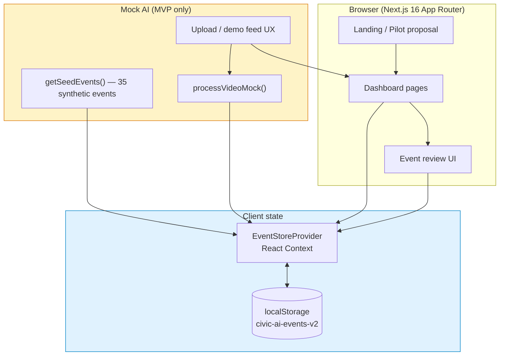
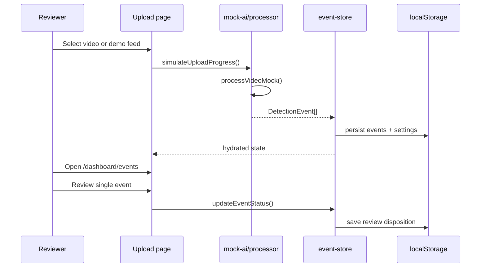
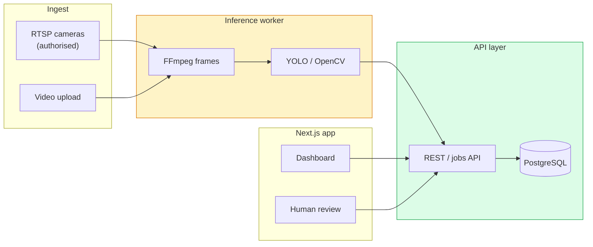

# Architecture

High-level view of the **AI Civic Operations & Road Safety Intelligence Platform** (MVP v0.1).
For phased delivery detail, see [ROADMAP.md](../ROADMAP.md).

---

## System overview (MVP)



**Key idea:** The MVP runs entirely in the browser. Detections are **synthetic**; officials still use the real **human review** workflow (confirm / reject / field verify).

---

## Request & data flow (upload path)



---

## Planned architecture (Phase 2+)



Phase 2 replaces `processVideoMock()` with a swappable worker behind `AI_PROCESSING_MODE=worker`. Search the codebase for **`REAL AI INTEGRATION`** for hook points.

---

## Layer responsibilities

| Layer | Path | Responsibility |
|-------|------|----------------|
| **Routes** | `src/app/` | Pages, layouts, metadata, OG image |
| **UI components** | `src/components/` | Dashboard widgets, layout, shadcn/ui |
| **Domain types** | `src/types/` | `DetectionEvent`, `ReviewStatus`, event enums |
| **Mock AI** | `src/lib/mock-ai/` | Synthetic inference — **replace in Phase 2** |
| **Data & state** | `src/lib/data/` | Event store, Barasat locations, pilot copy |
| **Constants** | `src/lib/constants.ts` | Labels, disclaimers, platform name |
| **CI** | `.github/workflows/ci.yml` | typecheck, lint, build on every PR |

---

## Human review gate (non-negotiable)

Every detection path must pass through official review before any external action:

```
AI signal → pending → confirmed | rejected | needs_field_verification
```

No branch bypasses this gate for enforcement, ticketing, or prosecution in this repository.

---

## Related docs

- [README.md](../README.md) — install & quick start
- [CONTRIBUTING.md](../CONTRIBUTING.md) — student & contributor guide
- [src/lib/data/README.md](../src/lib/data/README.md) — synthetic data policy
