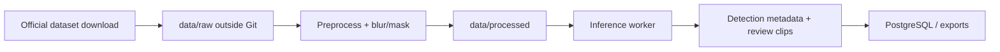

# Data architecture

How footage and datasets relate to the **AI Civic Operations & Road Safety Intelligence Platform** — without bundling sensitive video in Git.

---

## Principles

| Principle | MVP (v0.1) |
|-----------|------------|
| **Repo ships mock data only** | 35 synthetic events in `src/lib/data/` — no real video |
| **Large datasets live outside Git** | Use local `data/` at repo root (gitignored) |
| **Metadata in repo** | `src/lib/data-sources.ts` — names, licenses, status only |
| **Public demo** | Placeholders + mock processor — no real inference |
| **Future workers** | Read paths from env vars — never from committed blobs |

Full policy: [DATA_SOURCES.md](../../DATA_SOURCES.md)

---

## Recommended local folder structure

Run `npm run prepare:data` to create:

```
data/                          # gitignored at repo root — never commit
  raw/                         # manual downloads from official sources
  processed/                   # resized clips, frame extracts
  samples/                     # small clips for local dev only
  annotations/                 # labels, COCO/YOLO exports
  exports/                     # evidence clips after blur/mask
  README.local.md              # generated — local-only reminder
  sources.example.json         # copy → sources.json for your machine
```

**`public/demo-placeholders/`** is for tiny safe assets only (see its README). Not for CCTV or large clips.

---

## Metadata JSON pattern

Copy `data/sources.example.json` → `data/sources.json` (ignored) after `prepare:data`:

```json
{
  "datasets": [
    {
      "id": "bdd100k",
      "localPath": "data/raw/bdd100k",
      "downloadedAt": "2026-07-06",
      "license": "BDD100K terms — see official site",
      "notes": "Training/eval only — not for public demo redistribution"
    }
  ]
}
```

Phase 2 workers will read `DATA_ROOT` and optional `DATASET_MANIFEST` — not hardcoded repo paths.

---

## Workflow (Phase 2+)



1. Choose a **licensed** source from [DATA_SOURCES.md](../../DATA_SOURCES.md)
2. Download manually to `data/raw/`
3. Preprocess locally — resize, sample frames, blur faces/plates
4. Run inference worker (planned) — store **metadata** and minimal evidence
5. Human review in dashboard — no automatic enforcement

---

## What not to put in this repo

- `*.mp4`, `*.mov`, `*.avi`, large `*.zip` archives
- Model weights (`*.pt`, `*.onnx`) — use separate artifact storage
- Raw municipal CCTV without written pilot agreement
- Scraped stream recordings

`.gitignore` enforces this at commit time.

---

## UI & docs cross-links

| Resource | Location |
|----------|----------|
| Policy (root) | [DATA_SOURCES.md](../../DATA_SOURCES.md) |
| Registry (code) | `src/lib/data-sources.ts` |
| Dashboard page | `/dashboard/data-sources` |
| Synthetic events | `src/lib/data/README.md` |
